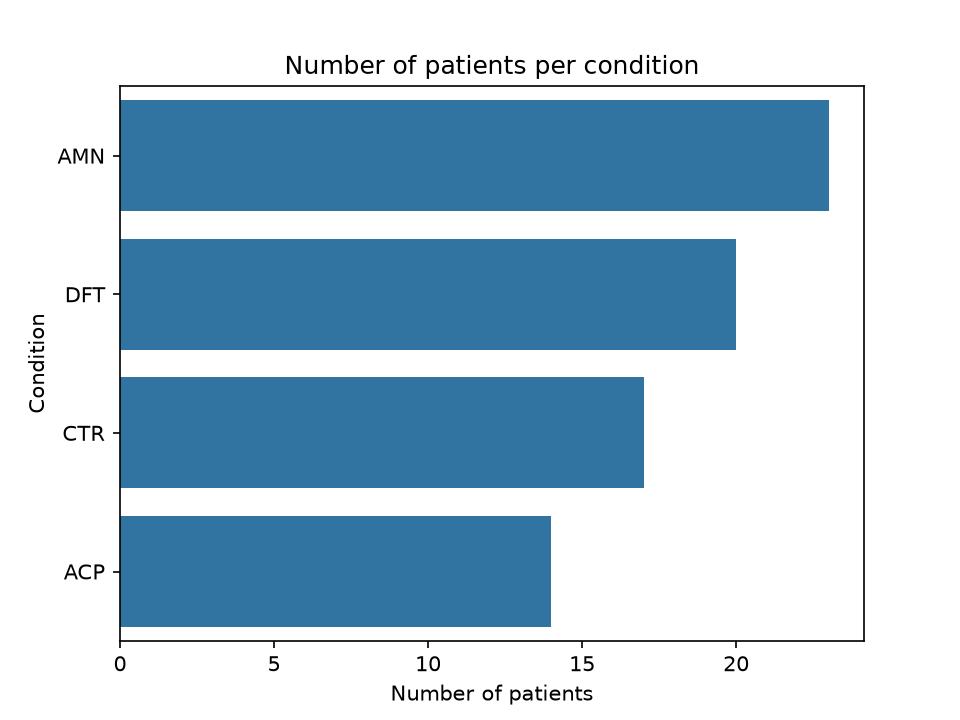
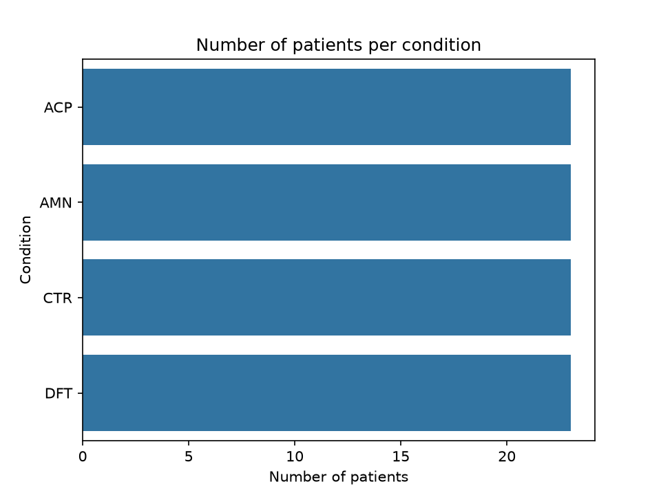
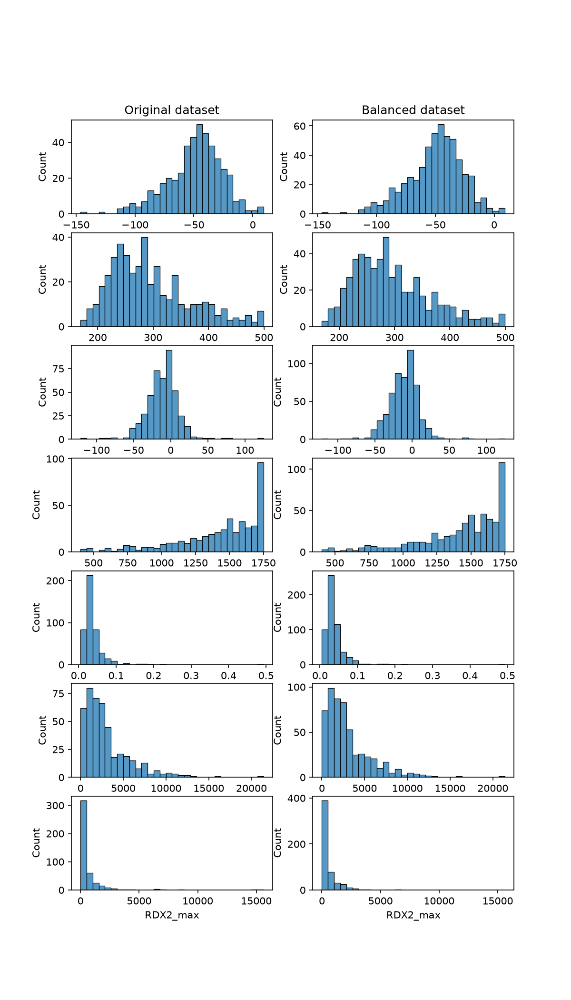

# Project Progress & Decisions

## Overview
This document tracks the key steps, decisions, and findings throughout the project. Figures are stored in the `figures/` folder.

---

## Data organisation
The data tracked pupil diameter for both eyes in both axis. Therefore, four data streams were collected: right eye horizontal (RDX), right eye vertical (RDY), left eye horizontal (LDX) and left eye vertical (LDY). The units of measurement is pixels.

## Data acquisition information
Participants were shown 18 images for 6 seconds each that varied in category (face or objet) and valence (positive, neutral or negative). Each participant ran the experiment twice, meaning there are 36 timeseries per participant.

---

## Phase 1: Pre-processing

### Objective:
Take the raw data and extract the required timeseries

### Approach:
I used a classical approach presented in the literature for pupil diameter analysis

### 1. Extract time windows
- The first step was to extract the time windows for each trial. From the time windows I could then have the corresponding time series of each eye recording as well as the corresponding category and valence for that trial.

### 2. Remove blinks
- When looking at the raw timeseries, it was clear that they were highly contaminated by blinks. Blinks are very clear peaks in the data that greatly surpass the range of the possible pupillary responses. I detected the blinks by flagging a blink as any point that crosses the threshold which was set as 1.5 times the mean of the overall response. Once a blink was detected a time window around the peak of the blink was extracted which was determined as 60ms before and after the peak. The time windows were then used to set the these sections of the timeseries to NaNs. A timeseries was removed if more than 30% of the timeseries consisted of blinks. The NaNs were then linearly interpolated. In most cases this method worked well however it wasn't bulletproof and many timeseries still had blinks moving forward.

### 3. Smoothing
- After detecting, removing and interpolating the blinks I next wanted to smooth each timeseries. The timeseries were all contaminated by noise, some more than others. A lowpass filter at 15Hz was applied using a butterworth filter.

### 4. Baseline correction
- Each time series was then baseline corrected. This was done by substracting the mean of the 200ms prior to the image onset from the whole timeseries. One issue is that if there was a blink during those 200ms, this would greatly skew the mean. Thereofore this needs to be looked into as some outliers were later identified for what seemed like incorrect baseline correction.

### 5. Remove bad signals
- Two removal conditions were applied. The first being if the mean of the timeseries response is greater than 0 and secondly if within the first second there is a response greater than 100. Only one of these has to be satisfied to remove a timeseries. These need to be further refined and thought about.

### Next Steps:
- Review baseline correction and bad signals criteria

### Ideas:
- Potential exlcusion criteria could be the variance between 2 and 6 seconds. 
- For blink detection you could include a buffer before onset and after offset to detect blinks at the start and at the end
- Trim the first 50 frames to remove affect of early blinks
- Baseline correction before blink detection? Could this help detect more blinks? Since you know it will set the starting point at 0. 
---

## Phase 2: Feature Extraction

### Objective:
Aim is take the timeseries and extract variables from them that would be used for modelling later on

### Approach:
The current approach is to just take variables straight from the timeseries. Next I would like to use mathematical models to extract variables and also explore alternative variables using feature engineering.

### 1. Compute rolling average
1. I computed the rolling average because even after doing the pre-processing of the timeseries, they were still noisy so I applied the rolling average to smooth them out more.

### 2. Extract features
1. Using pandas pd.groupby() function and .transform() I extracted the minimum, latency at the minimum, the maximum, latency at the maximum and the gradient of the response between 2 and 4 seconds.

### Figures:

### Next Steps:

---

## Phase 3: Data preperation

### Objective:
Prepare the data for modeling

### Approach:
I planned out the main steps I wanted do which included cleaning the data (dealing with outliers), formatting the data (encoding categorical data, scaling data, standardization and discretization) and potentially data engineering (whilst I would do this after having trained the first models). Before doing this I first had to split the data in train and test.

### 1. Encoding categorical data
- I had two categorical data columns (category and valence) so encoded them using sklearn.preprocessing.OneHotEncoder

### 2. Handling missing data
1. I first looked at how much data was missing per eye-coordinate recording (RDX, RDY, LDX, LDY)

- I chose to focuse my analysis on only the RDX data as it had the least amount of missing data
2. I then looked at to see how much missing data there was per condition within the RDX data

3. I removed all of the rows where I had NaNs for the RDX data only. The table shows the effect of removing this data. The table shows the number of participants there was for each condition before and after removing the NaN rows.

|     | Before removing NaNs | After removing NaNs| Percentage drop (%) |
|:---:|:--------------------:|:------------------:|:-------------------:|
|AMN  |          27          |          23        |       14.8          |
|DFT  |          24          |          20        |       16.6          |
|ACP  |          15          |          14        |       6.6           |
|CTR  |          21          |          17        |       19.0          |

### 3. Train_test_split
1.  Before doing anything with the data I need to split it into train and test. GroupShuffleSplit was used to ensure that the same participant cannot be in both the train and test dataset. One issue is that I could get a test set with a condition being over or under represented. Need to look into whether I can fix this directly with GroupShuffleSplit or I need to use CV with k-fold iterations.

### 4. Outlier detection
1. Started by looking at scatter plots of max against latency of max and min against latency of min. I noticed that some of the trials had latency of min at 0 which wouldn't make sense. I noticed that this was because these were trials with blinks at the start. I therefore took the minimum at 50 time points after onset and 50 time points before offset. This also reduced the impact of blinks at the end of trials.

### 3. Scaling
1. Due to the probable influence of outliers in my dataset i chose to use the RobustScaler to scale with the median and not with the mean.

### Next Steps:
- Use GroupKFolds
- Try data balancing to see if it affects performance
- 1) I have my current dataset (26/08) and will use it to train models first time round. I will then find the model that works the best and use it as my reference. I will also train the models on the curve-fit variables to see if it improves.
- 2) I will then improve my pre-processing pipeline (blink detection as such) and variables (consider RDY maybe) and retrain models to see. Also do the same for the curve-fitting, does the model improve and test other curve-fitting models as well.

## Phase 4: Modelling phase 1

### Objective:
Train various models and see how they perform

### Approach:
The idea would be to train multiple classification models and then see how they each perform. I would then want to look into the models to see where they perform well or not, using ablation techniques. I also want to explore other methods presented in the DESU to test model performance.

### 1. training dummy and reference model
- I tried a dummy model with uniform strategy and LogisiticRegression model with the default parameters

|         | DummyClassifier | LogisiticRegression |
|:-------:|:---------------:|:-------------------:|
|Score (%)|      25.23      |        33.33        |

- We can see that the DummyClassifier performs at chance and the LogisticRegression just slightly better. I will use the LogisticRegression model as reference

### 2. Training the models
- I trained 6 models (SVC, RandomForestClassifier, LogisiticRegression, GradientBoostingClassifier, KNeighborsClassifier and AdaBoostClassifier) using a GridSearchCV on 7 outer iterations and 5 inner folds per iteration.
- Below is the best score and corresponding for each of the 7 iterations for one of the GridSearchCV runs (scores vary between runs but remain in this range):

|        |      Iteration 1     | Iteration 2 | Iteration 3 |         Iteration 4        |     Iteration 5    |       Iteration 6      |       Iteration 7      |
|:------:|:--------------------:|:-----------:|:-----------:|:--------------------------:|:------------------:|:----------------------:|:----------------------:|
|Score(%)|          20.00       |   33.33     |    25.56    |           27.78            |        32.22       |          13.33         |         14.44          |
|Model   |  LogisticRegression  |     SVC     |     SVC     | GradientBoostingClassifier | LogisticRegression | RandomForestClassifier | RandomForestClassifier |

- We can see that none of the optimised models perform better than the reference model.
- I also tested the balanced accuracy scores which were all around 0 indicating that my model is simply guessing and not actually learning anything

### 3. Look back at the data
- Clearly the models are not performing well. Two reasons this could be: 1. wrong hyperparamater selection for GridSearch, 2. data is bad. I think the issue is more on the data than the hyperparameter tuning. One clear issue that stands out in my data is the inbalance in the size of the groups. As shown earlier there is 14 ACP compared to 23 AMN which creates a clear imbalance. When I looked into the kFold splits, some splits consistently contained more AMN then all other groups and sometimes had only 1 or 2 ACP patients in the training set. This is a clear issue.
- I can think of two solutions to this issue: 1. The first to rebalance the data 2. Use the split=True in the GroupShuffleSplit to ensure an equal number of groups per split

#### SMOTE algorithm for rebalancing
- I used the imbalanced-learn library for rebalancing. Two algorithms are proposed for oversampling (SMOTE and ADASYN).
- I first tested the SMOTE dataset. To ensure no data leakage it was applied only to the training dataset but I did a proof of concept on the original dataset. Doing so balanced out all my groups and increased my datapoints from 444 to 552. As you can see from the distributions below, after SMOTE balancing they remain the same but the groups are now balanced.

#### Training models using SMOTE rebalancing
- I used StratifiedGroupKFold() instead of GroupShuffleSplit() as it this method aims to have equal number of groups in train and test sets. This is important as I would want the test set to be balanced and then I would balance the train set myself.
- 

### 4. Fixing the imbalance

### 3. Analysing mistakes
- I wanted to see where the models were performing well and when they were failing
1. 

### 3. Check the data

### Next Steps:
- Look at the models
- Look at the data
  1) Under representation of groups (try test shuffle split)
- Try with 'better' data