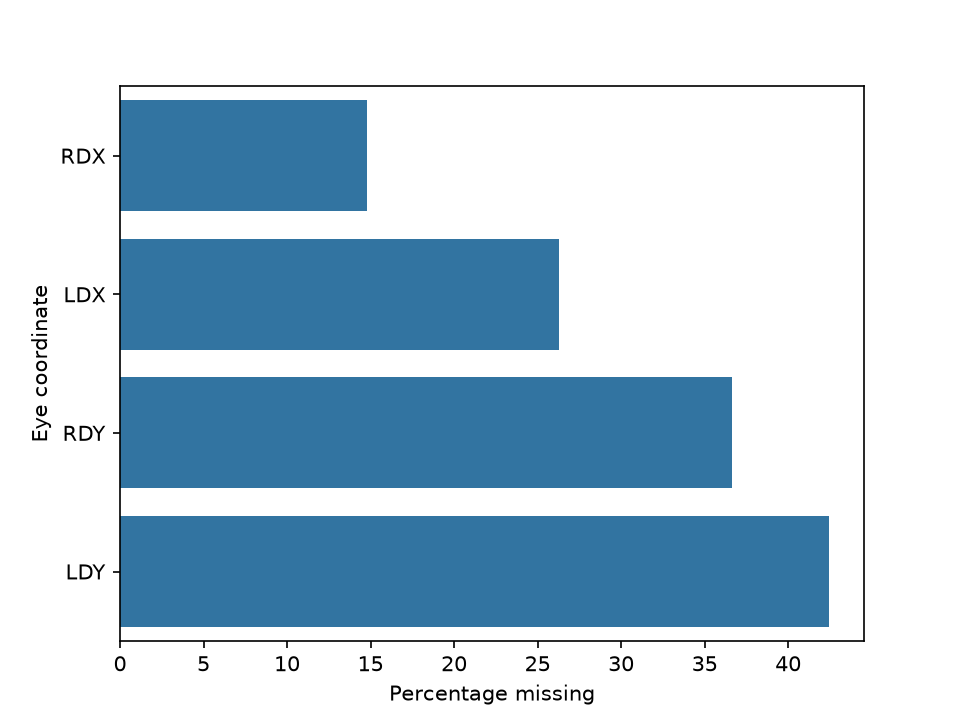
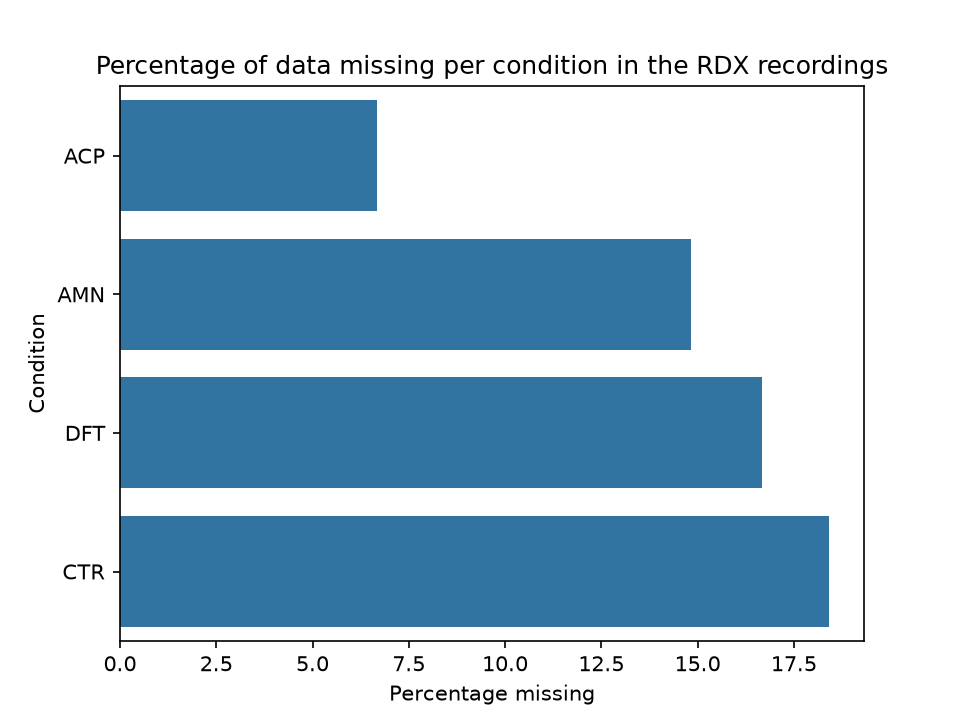

# Project Progress & Decisions

## Overview
This document tracks the key steps, decisions, and findings throughout the project. Figures are stored in the `figures/` folder.

---

## Data organisation
The data tracked pupil diameter for both eyes in both axis. Therefore, four data streams were collected: right eye horizontal (RDX), right eye vertical (RDY), left eye horizontal (LDX) and left eye vertical (LDY). The units of measurement is pixels.

## Data acquisition information
Participants were shown 18 images for 6 seconds each that varied in category (face or objet) and valence (positive, neutral or negative). Each participant ran the experiment twice, meaning there are 36 timeseries per participant.

---

## Phase 1: Pre-processing

### Objective:
Take the raw data and extract the required timeseries

### Approach:
I used a classical approach presented in the literature for pupil diameter analysis

### 1. Extract time windows
- The first step was to extract the time windows for each trial. From the time windows I could then have the corresponding time series of each eye recording as well as the corresponding category and valence for that trial.

### 2. Remove blinks
- When looking at the raw timeseries, it was clear that they were highly contaminated by blinks. Blinks are very clear peaks in the data that greatly surpass the range of the possible pupillary responses. I detected the blinks by flagging a blink as any point that crosses the threshold which was set as 1.5 times the mean of the overall response. Once a blink was detected a time window around the peak of the blink was extracted which was determined as 60ms before and after the peak. The time windows were then used to set the these sections of the timeseries to NaNs. A timeseries was removed if more than 30% of the timeseries consisted of blinks. The NaNs were then linearly interpolated. In most cases this method worked well however it wasn't bulletproof and many timeseries still had blinks moving forward.

### 3. Smoothing
- After detecting, removing and interpolating the blinks I next wanted to smooth each timeseries. The timeseries were all contaminated by noise, some more than others. A lowpass filter at 15Hz was applied using a butterworth filter.

### 4. Baseline correction
- Each time series was then baseline corrected. This was done by substracting the mean of the 200ms prior to the image onset from the whole timeseries. One issue is that if there was a blink during those 200ms, this would greatly skew the mean. Thereofore this needs to be looked into as some outliers were later identified for what seemed like incorrect baseline correction.

### 5. Remove bad signals
- Two removal conditions were applied. The first being if the mean of the timeseries response is greater than 0 and secondly if within the first second there is a response greater than 100. Only one of these has to be satisfied to remove a timeseries. These need to be further refined and thought about.

### Next Steps:
- Review baseline correction and bad signals criteria
---

## Phase 2: Feature Extraction

### Objective:
Aim is take the timeseries and extract variables from them that would be used for modelling later on

### Approach:
The current approach is to just take variables straight from the timeseries. Next I would like to use mathematical models to extract variables and also explore alternative variables using feature engineering.

### 1. Compute rolling average
1. I computed the rolling average because even after doing the pre-processing of the timeseries, they were still noisy so I applied the rolling average to smooth them out more.

### 2. Extract features
1. Using pandas pd.groupby() function and .transform() I extracted the minimum, latency at the minimum, the maximum, latency at the maximum and the gradient of the response between 2 and 4 seconds.

### Figures:

### Next Steps:

---

## Phase 3: Data preperation

### Objective:
Prepare the data for modeling

### Approach:
I planned out the main steps I wanted do which included cleaning the data (dealing with outliers), formatting the data (encoding categorical data, scaling data, standardization and discretization) and potentially data engineering (whilst I would do this after having trained the first models). Before doing this I first had to split the data in train and test.

### 1. Encoding categorical data
- I had two categorical data columns (category and valence) so encoded them using sklearn.preprocessing.OneHotEncoder

### 2. Handling missing data
1. I first looked at how much data was missing per eye-coordinate recording (RDX, RDY, LDX, LDY)

- I chose to focuse my analysis on only the RDX data as it had the least amount of missing data
2. I then looked at to see how much missing data there was per condition within the RDX data

3. I removed all of the rows where I had NaNs for the RDX data only. The table shows the effect of removing this data. The table shows the number of participants there was for each condition before and after removing the NaN rows.

|     | Before removing NaNs | After removing NaNs| Percentage drop (%) |
|:---:|:--------------------:|:------------------:|:-------------------:|
|AMN  |          27          |          23        |       14.8          |
|DFT  |          24          |          20        |       16.6          |
|ACP  |          15          |          14        |       6.6           |
|CTR  |          21          |          17        |       19.0          |

### 3. Train_test_split
1.  Before doing anything with the data I need to split it into train and test. GroupShuffleSplit was used to ensure that the same participant cannot be in both the train and test dataset. One issue is that I could get a test set with a condition being over or under represented. Need to look into whether I can fix this directly with GroupShuffleSplit or I need to use CV with k-fold iterations.

### 4. Outlier detection
1. Started by looking at scatter plots of max against latency of max and min against latency of min. I noticed that some of the trials had latency of min at 0 which wouldn't make sense. I noticed that this was because these were trials with blinks at the start. I therefore took the minimum at 50 time points after onset and 50 time points before offset. This also reduced the impact of blinks at the end of trials.

### 3. Scaling
1. Due to the probable influence of outliers in my dataset i chose to use the RobustScaler to scale with the median and not with the mean.

### Next Steps:
- Use GroupKFolds
- Try data balancing to see if it affects performance
